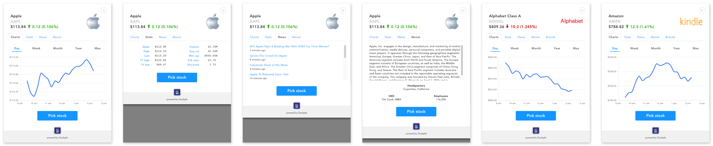

# Stockpile Modal
Display information about stocks and brands on your site or web application.
[See the demo](https://modal.stockpile.com/demo/).



## Glossary
* **Gift Item** An object representing a purchasable gift on Stockpile. You
can think of this as a stock or security in most cases, but there may also
be a specific brand tied to it, like "Microsoft Xbox" or "Amazon Kindle".

## Get Started

### Step 1: Get your publishable key
[Send an email request](mailto:partner@stockpile.com?Subject=Stockpile%20Modal&Body=Hello%2C%20I%20would%20like%20to%20use%20the%20Stockpile%20Modal%20on%20my%20website%20and%20would%20like%20a%20publishable%20key.) to get your publishable key.

### Step 2: Add modal markup and initialize the modal
Add the following markup in your site or web application. You should either
add this to the page `<head>` or at the end of your `<body>`:

```html
<script src="https://modal.stockpile.com/init.js"></script>
```

In a separate `<script>` tag, initialize the modal with your environment and
your publishable key. For your development or staging environments, you
should specify the first argument as `qa`. For your production environment,
you should specify `production`:

```html
<script>
Stockpile.init('qa', 'pk_qa_0123456789abcdef0123456789abcdef');
</script>
```

Note that the above publishable key is for demo purposes, you should request
your own as described in Step 1.

### Step 3: Open modal and handling close event
After initializing the modal, you need to specify when to open the modal. This
will probably be done after a user clicks on some sort of link or button. For
example, say you had some links that looked like this:

```html
<a href="#" class="brand" data-gift-item-code="AAPL::::AAPL::">Apple</a>
```

Then you could listen for `click` events on those links and open the modal like
this:

```html
<script>
document.addEventListener('click', function (event) {
  var target = event.target;
  if (!target.classList.contains('brand')) return;
  var giftItemCode = target.getAttribute('data-gift-item-code');
  Stockpile.open(giftItemCode);
});
</script>
```

After the modal is closed, a callback function will be called with the
**Gift Item** that the user selected. If the **Gift Item** displayed in the modal
was not selected, then `giftItem` will be `null`.

Example code to handle `close` event from the modal:
```html
<script>
Stockpile.onClose(function (giftItem) {
  if (!giftItem) {
    console.log('user did not select the displayed gift item');
  } else {
    console.log('user selected the displayed giftItem...');
    console.log(giftItem);
  }
});
</script>
```

Here is an example `giftItem` object for Amazon Kindle:
```json
{
  "brandName": "Kindle",
  "companyName": "Amazon.com, Inc.",
  "companyPopularName": "Amazon",
  "giftItemCode": "AMZN::KIND::AMZN::",
  "securitySymbol": "AMZN"
}
```
